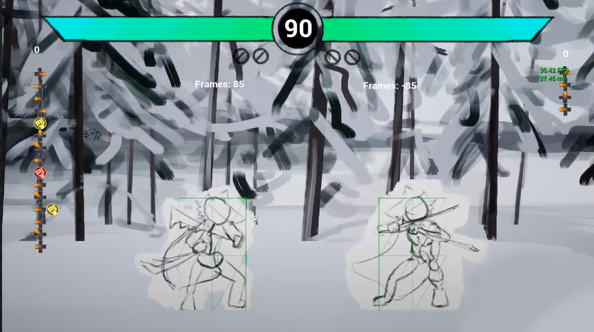

# Unreal 2D Fighter Project

A traditional 2D fighting game in development intended as a self-learning opportunity and a platform to explore fighting game ideas.

The project is currently in the process of integrating GGPO. Please rollback to at least commit 3a524861438a4d475dfc3ffbd147a9df028bb79c for a playable build.

All development, design, and art is done by Chunlok Lo.

Developed with Unreal Engine 4